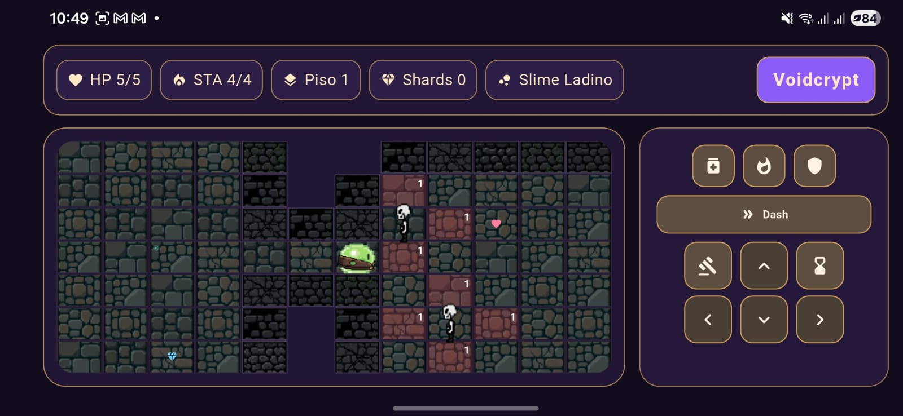

# Voidcrypt

Voidcrypt é um roguelike tático em turnos feito com Flutter. O jogo combina geração procedural de dungeon, progressão por run, sistema de stamina, classes jogáveis e inimigos com comportamentos distintos.

## Demo



## Sumário

- [Visão geral](#visão-geral)
- [Funcionalidades implementadas](#funcionalidades-implementadas)
- [Controles](#controles)
- [Dificuldade](#dificuldade)
- [Classes jogáveis](#classes-jogáveis)
- [Persistência de run](#persistência-de-run)
- [Estrutura principal do projeto](#estrutura-principal-do-projeto)
- [Como executar](#como-executar)
- [Assets](#assets)
- [Status do projeto](#status-do-projeto)

## Visão geral

- Plataforma: Flutter (Android, iOS, Web, Linux, macOS e Windows)
- Gênero: roguelike dungeon crawler em turnos
- Tema visual: dark fantasy com paleta roxo/dourado
- Orientação: landscape (forçada no app)

## Funcionalidades implementadas

### Progressão de run

- Relíquias passivas por piso:
  - +1 alcance de ataque
  - +10% de chance de crítico
  - +1 HP máximo e +1 de cura
- Escolha de recompensa ao concluir piso
- Loja entre pisos para gastar shards
- Mini-chefes em pisos específicos do ciclo de progressão

### Combate e IA

- Inimigos com IA distinta:
  - Pursuer (perseguidor)
  - Archer (ataque à distância)
  - Tank (mais resistente)
  - Summoner (invoca reforços)
  - Boss (variante de maior ameaça)
- Sistema de stamina:
  - Atacar consome stamina
  - Esperar recupera stamina
- Telegraph de dano inimigo no tabuleiro
- Knockback em golpes quando aplicável
- Visão inimiga limitada por distância e linha de visão

### Loot, economia e salas especiais

- Loot com raridades: comum, raro e épico
- Consumíveis na loja:
  - Poção
  - Bomba
  - Escudo Temporal
- Salas especiais:
  - Tesouro
  - Evento
  - Armadilha
  - Altar

### UX e apresentação

- Menu inicial com continuar run salva
- Seleção de dificuldade: Normal, Hard e Nightmare
- Seleção de classe antes de iniciar novo jogo
- Tela de game over com resumo da run
- Menu de pausa com retomar, reiniciar e sair

## Controles

### Painel de controles (UI)

- Movimento: cima, baixo, esquerda, direita
- Ações:
  - Atacar
  - Esperar
  - Habilidade da classe
- Itens:
  - Poção
  - Bomba
  - Escudo Temporal

### Gestos no tabuleiro

- Arrastar horizontal/vertical para mover o personagem

## Dificuldade

- Normal:
  - HP base do jogador: 5
  - Stamina base: 4
  - Bônus inimigo: +0 HP, +0 dano recebido
- Hard:
  - HP base do jogador: 4
  - Stamina base: 4
  - Bônus inimigo: +1 HP, +1 dano recebido
- Nightmare:
  - HP base do jogador: 4
  - Stamina base: 3
  - Bônus inimigo: +2 HP, +2 dano recebido

## Classes jogáveis

- Slime Ladino
- Slime Guardião
- Slime Ácido
- Slime Mago

Cada classe possui habilidade própria com cooldown.

## Persistência de run

- O jogo salva automaticamente o estado da run localmente.
- Ao abrir o menu inicial:
  - Se houver run salva, o botão principal vira Continuar Run.
  - Também é possível iniciar um Novo Jogo.

## Estrutura principal do projeto

- `lib/src/game/game_controller.dart`: estado da partida, turnos, IA, combate, persistência e game over
- `lib/src/game/dungeon_generator.dart`: geração procedural de mapas e salas
- `lib/src/game/game_page.dart`: tela principal, HUD, overlays e fluxo visual
- `lib/src/game/widgets/game_board.dart`: render do tabuleiro, sprites, gestos e efeitos visuais
- `lib/src/game/widgets/control_panel.dart`: controles e uso de itens/habilidades
- `lib/src/menu/main_menu_page.dart`: menu inicial, seleção de dificuldade/classe e continuar run
- `lib/src/game/models.dart`: modelos e enums do domínio

## Como executar

### Requisitos

- Flutter SDK compatível
- Dart SDK compatível com o `pubspec.yaml` (SDK `^3.10.7`)

### Passos

```bash
flutter pub get
flutter run
```

### Análise estática

```bash
flutter analyze
```

## Assets

- Personagem com sprites direcionais
- Sprites direcionais para os tipos de inimigo
- Tiles de piso e muro
- Ícones e recursos visuais em `assets/`

### Créditos de assets

- Todos os assets visuais do jogo foram criados usando https://www.pixellab.ai.

## Status do projeto

O projeto já possui um loop principal robusto de gameplay (geração, combate, progressão, economia, pausa, persistência e game over) e está pronto para iterações de balanceamento e expansão de conteúdo.
